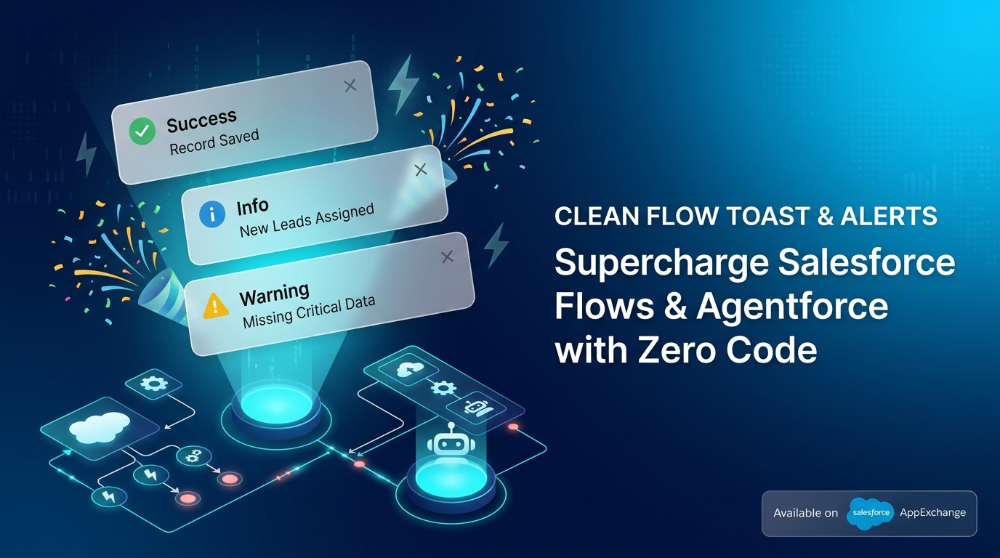
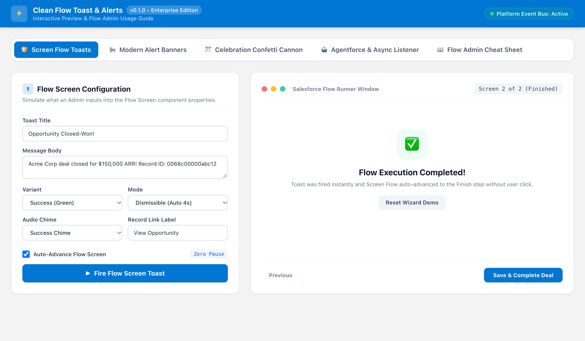
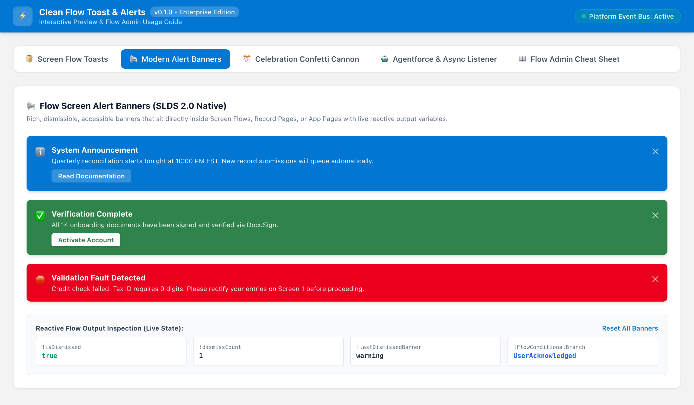
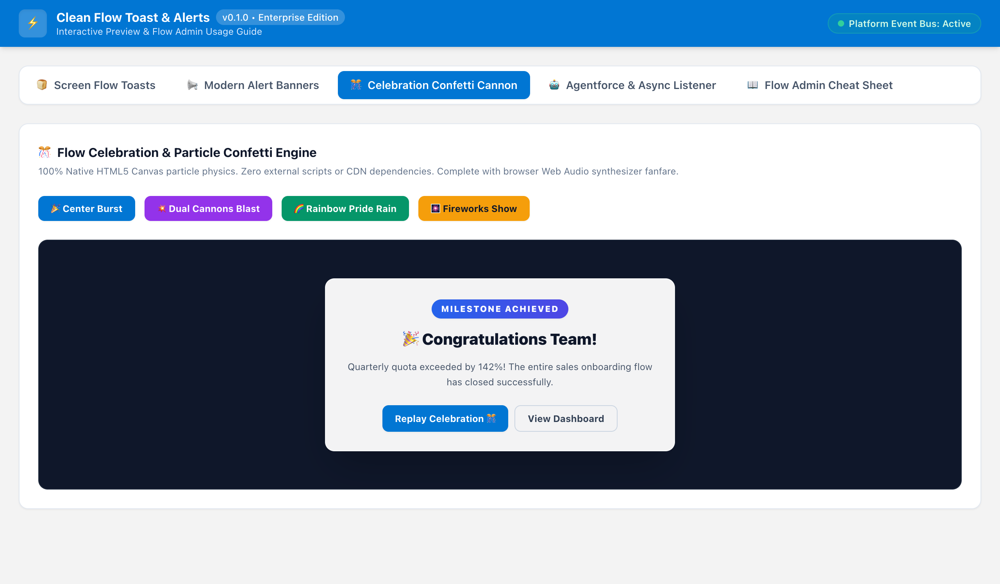
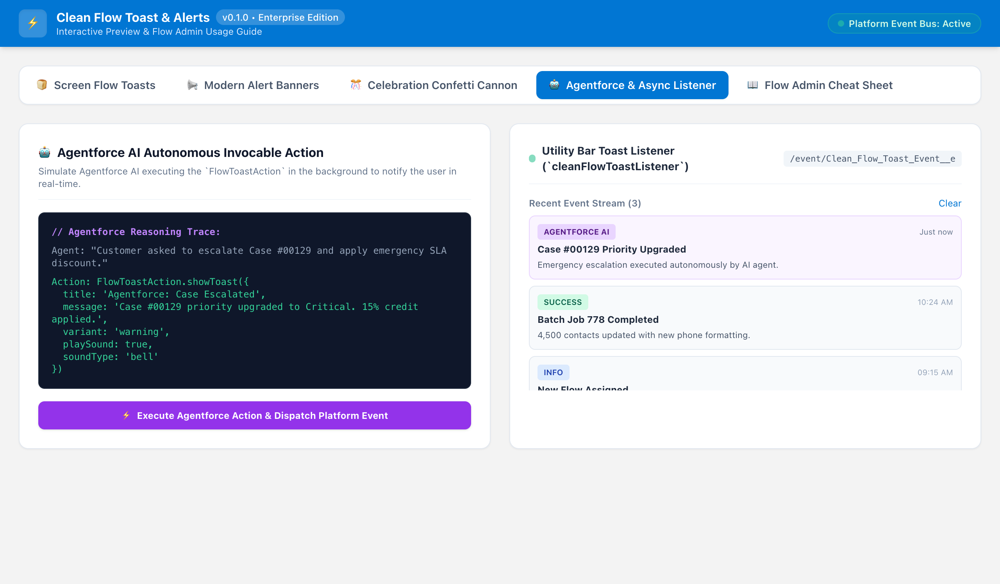

# Clean Flow Toast & Alerts (Flow UI Supercharger)

<p align="center">
  
</p>

> **Open-Source (MIT)** | Built for the Trailblazer & Salesforce Developer Community | 100% Native & Enterprise-Grade

[](https://github.com/arsalan-arshad/clean-flow-toast-alerts/actions/workflows/ci.yml)
[](https://github.com/arsalan-arshad/clean-flow-toast-alerts/actions/workflows/cd.yml)
[-blue.svg?logo=salesforce)](https://login.salesforce.com/packaging/installPackage.apexp?p0=04tg7000000WDVBAA4)
[](https://test.salesforce.com/packaging/installPackage.apexp?p0=04tg7000000WDVBAA4)
[](#6-verification--test-suite)
[](#lwc-jest-unit-tests)
[](#-killer-differentiators)
[](LICENSE)

---

## 1. Overview & Vision

Salesforce Admins build hundreds of thousands of Screen Flows and Autolaunched Flows every day. However, native Flow feedback has historically been clunky and restricted:
- Standard Flows **cannot fire native Salesforce Toast notifications** without writing custom code or installing bloated legacy packages.
- Flow screens lack modern, themeable SLDS callout banners with reactive decision branching.
- Significant milestones (Opportunity Closed-Won, Case Solved, Onboarding Complete) lack celebratory delight like confetti and audio fanfare.
- Headless Flows and **Agentforce AI Agents** had no simple, native way to trigger real-time UI notifications for human users in their active browser sessions.

**Clean Flow Toast & Alerts** is a 100% native, zero-dependency, open-source Lightning Web Component and Apex suite that supercharges Salesforce Flows with modern toasts, reactive alert banners, celebratory particle engines, and utility bar notifications.

---

## 2. 🚀 1-Click Installation

Install the official Second-Generation Managed Package (2GP Released `v0.1.0`) directly into your Salesforce environment:

| Target Org Environment | 1-Click Direct Installation Link |
| :--- | :--- |
| **Production / Developer Edition** | [👉 **Install in Production / Dev Org (04tg7000000WDVBAA4)**](https://login.salesforce.com/packaging/installPackage.apexp?p0=04tg7000000WDVBAA4) |
| **Sandbox Environment** | [👉 **Install in Sandbox (04tg7000000WDVBAA4)**](https://test.salesforce.com/packaging/installPackage.apexp?p0=04tg7000000WDVBAA4) |

### Install via Salesforce CLI (`sf`):
```bash
sf package install --package 04tg7000000WDVBAA4 --wait 20 --target-org <YOUR_ORG_ALIAS>
```

---

## 3. 🌟 Killer Differentiators

| Feature | Standard Salesforce Flows / Legacy Packages | Clean Flow Toast & Alerts |
| :--- | :--- | :--- |
| **Toast Engine** | None natively; requires custom Aura wrappers | **Dual-Engine:** Direct client-side `platformShowToastEvent` + Async Platform Event publishing |
| **Flow Reactivity** | Banners are static display text | **Reactive Decision Branching:** Outputs `isDismissed` and `dismissCount` in real time to drive downstream Flow components |
| **Celebration & Delight** | Zero animations | **Zero-Dependency Canvas Engine:** Confetti, Cannons, Rain, and Fireworks rendered via pure HTML5 Canvas |
| **Audio Feedback** | None or requires blocked external MP3 URLs | **Pure Web Audio API Synthesizer:** Multi-tone chords generated dynamically in-browser (Zero CSP issues) |
| **Agentforce & Async Ready** | Limited to standard Chatter or Email alerts | **Utility Bar empApi Listener:** Headless Flows and Agentforce AI Agents broadcast real-time toasts across user sessions |
| **Performance & Weight** | Heavy 3rd-party static resources (1MB+) | **Ultra-Lightweight (<30KB):** Pure SLDS + native browser APIs |

---

## 4. 📸 Visual Walkthrough

### 1. Screen Flow Toast Launcher (`c-clean-flow-toast`)
Fire standard dismissible, pester, or sticky toasts with custom title, message, url navigation, and auto-advance.
<p align="center">
  
</p>

### 2. SLDS Reactive Alert Banners (`c-clean-flow-alert-banner`)
Embed rich, dismissible alert callouts directly into your Flow screens with countdown timers and reactive Flow variables.
<p align="center">
  
</p>

### 3. Canvas Celebration Engine (`c-clean-flow-celebration`)
Reward users with particle physics confetti bursts, celebratory sound fanfare, and auto-dismissing celebration screens.
<p align="center">
  
</p>

### 4. Utility Bar Platform Event Listener & Agentforce Feed (`c-clean-flow-toast-listener`)
Listen for background Platform Events from Autolaunched Flows, Apex Triggers, or Agentforce AI and review recent notifications in the toast history drawer.
<p align="center">
  
</p>

---

## 5. 🛠️ Admin Setup & Flow Builder Guide

### Step 1: Assign Permission Set
Assign the `Clean_Flow_Toast_User` permission set to users, admins, or integration personas:
```bash
sf org assign permset -n Clean_Flow_Toast_User
```

---

### Step 2: Configure Components in Flow Builder

#### A. Screen Flow Toast Launcher (`cleanFlowToast`)
Drag onto any Screen Flow step to trigger a native toast upon screen display.
- **Title:** e.g., `Account Created!`
- **Message:** e.g., `The account {!AccountName} was successfully created.`
- **Variant:** `success`, `error`, `warning`, `info`
- **Mode:** `dismissible`, `pester`, `sticky`
- **Auto Advance Flow:** `true` (automatically advances the flow to the next step after firing)
- **Play Sound:** `true`
- **Sound Type:** `success`, `warning`, `error`, `celebration`
- **Target URL / Record ID:** Navigates directly to the record upon user click.

#### B. Reactive Alert Banner (`cleanFlowAlertBanner`)
Drag onto any Flow Screen to display an SLDS-styled notice or inline banner.
- **Theme:** `info`, `warning`, `error`, `success`
- **Heading & Message:** Rich text or Flow formula variables.
- **Is Dismissible:** `true` / `false`
- **Auto Dismiss Seconds:** e.g., `10` (includes animated countdown bar).
- **Reactive Flow Outputs:**
  - `isDismissed` (Boolean) &mdash; use in conditional visibility for downstream components or Flow decisions!
  - `dismissCount` (Number) &mdash; tracks user dismissals during session.

#### C. Confetti Celebration Engine (`cleanFlowCelebration`)
Drag onto completion screens (e.g., Closed-Won Opportunity, Onboarding Survey complete).
- **Style:** `confetti`, `cannons`, `rain`, `fireworks`
- **Particle Count:** `50` to `300` (default: 150)
- **Duration (Seconds):** `1` to `10` (default: 3)
- **Play Audio:** `true` (synthesizes audio fanfare via Web Audio API)

#### D. Utility Bar empApi Listener (`cleanFlowToastListener`)
Add to your Salesforce App's **Utility Bar** (App Manager $\rightarrow$ Edit App $\rightarrow$ Utility Items $\rightarrow$ Add `Clean Flow Toast Listener`).
- Listens to `/event/Clean_Flow_Toast_Event__e` across all user tabs.
- Respects `Target_User_Id__c` so users only receive toasts intended for them (or broadcasts).
- Includes slide-out **Notification History Drawer** to review past alerts.

---

### Step 3: Invocable Action in Headless Flows & Agentforce

Add an **Action** element in any Autolaunched Flow, Record-Triggered Flow, or Agentforce Agent:
1. Search for `Show Toast or Alert (Flow / Agentforce)`.
2. Map parameters:
   - `Title` (String)
   - `Message` (String)
   - `Variant` (String: `success`, `error`, `warning`, `info`)
   - `Mode` (String: `dismissible`, `pester`, `sticky`)
   - `Target User Id` (Id of user to notify, or blank for all)
   - `Play Sound` (Boolean)
   - `Sound Type` (String)
   - `Record Id` (Id for 1-click navigation)

#### Apex Code Usage:
Developers can also publish toasts directly in Apex triggers or batch jobs:
```apex
FlowToastAction.ToastRequest req = new FlowToastAction.ToastRequest();
req.title = 'Order Processed';
req.message = 'Order #' + order.OrderNumber + ' successfully synced with ERP.';
req.variant = 'success';
req.targetUserId = order.OwnerId;
req.recordId = order.Id;
req.playSound = true;
req.soundType = 'success';

List<FlowToastAction.ToastResult> results = FlowToastAction.showToast(
    new List<FlowToastAction.ToastRequest>{ req }
);
```

---

## 6. 🏛️ Architecture & Component Reference

```
force-app/main/default/
├── classes/
│   ├── FlowToastService.cls             # Enterprise validation, bounds, normalization & EventBus publisher
│   ├── FlowToastAction.cls              # Invocable Action for Flows and Agentforce AI
│   ├── FlowToastController.cls          # AuraEnabled endpoints for LWC UI
│   ├── FlowToastServiceTest.cls         # Service layer tests (89% coverage)
│   ├── FlowToastActionTest.cls          # Invocable action tests (100% coverage)
│   └── FlowToastControllerTest.cls      # Controller unit tests (100% coverage)
├── lwc/
│   ├── cleanFlowToast/                  # Headless & Screen Flow toast launcher with auto-advance
│   ├── cleanFlowAlertBanner/            # SLDS alert banner with reactive Flow outputs & countdown
│   ├── cleanFlowCelebration/            # Pure HTML5 Canvas confetti & particle engine
│   ├── cleanFlowToastListener/          # Utility bar empApi subscriber with toast history drawer
│   └── cleanFlowAudioHelper/            # Pure Web Audio API tone synthesis module
├── objects/
│   └── Clean_Flow_Toast_Event__e/       # Platform Event definition with 10 custom fields
└── permissionsets/
    └── Clean_Flow_Toast_User.permissionset-meta.xml
```

---

## 7. 🧪 Verification & Test Suite

### Apex Unit Tests
```bash
sf apex run test --class-names FlowToastServiceTest --class-names FlowToastActionTest --class-names FlowToastControllerTest --code-coverage --result-format human --wait 5
```
**Results:**
- `FlowToastAction`: **100%** code coverage
- `FlowToastController`: **100%** code coverage
- `FlowToastService`: **89%** code coverage
- **Overall Apex Code Coverage: 93.00%**
- Test Pass Rate: **100%** (19 of 19 tests pass across positive, negative, and bulk scenarios)

### LWC Jest Unit Tests
```bash
npm run test:unit
```
**Results:** **17 passed, 17 total** across all components (`cleanFlowToast`, `cleanFlowAlertBanner`, `cleanFlowCelebration`, `cleanFlowToastListener`, `cleanFlowAudioHelper`).

### Code Quality & Standards
```bash
npm run lint
npm run prettier:check
```
- **ESLint:** 0 errors, 0 warnings.
- **Prettier:** 100% formatted.

---

## 8. 🔄 Automated CI/CD Pipelines

- **Pull Request Verification (CI - `.github/workflows/ci.yml`):**
  - Triggers on every PR targeting `main`.
  - Runs ESLint, Prettier, and LWC Jest unit tests.
  - Headlessly deploys and validates all Apex test classes against a scratch or developer org (`sf project deploy validate --test-level RunLocalTests`).
  - Guardrails `main` with strict branch protection rules.

- **Continuous Deployment (CD - `.github/workflows/cd.yml`):**
  - Triggers automatically upon merge to `main`.
  - Deploys source metadata and runs full regression tests (`sf project deploy start --test-level RunLocalTests`).
  - Generates deployment summaries directly in GitHub Actions.

---

## 9. 🗺️ Open-Source Roadmap

- [x] Pure client-side `platformShowToastEvent` Flow launcher.
- [x] SLDS reactive alert banner with countdown timer and `isDismissed` reactivity.
- [x] Zero-dependency HTML5 Canvas confetti, cannons, rain, and fireworks engine.
- [x] Web Audio API dynamic audio chord synthesizer.
- [x] Async Platform Event engine (`Clean_Flow_Toast_Event__e`) for headless flows.
- [x] Utility Bar empApi live listener and notification history drawer.
- [x] First-class Agentforce AI invocable action integration.
- [x] Released 2GP Package (`v0.1.0`) with 93% test coverage.
- [ ] Multi-language Custom Label internationalization (i18n).
- [ ] Sticky modal popup launcher for critical admin interventions.

---

## 10. 📄 License & Community Contributions

Distributed under the **MIT License**. Contributions, bug reports, and feature requests are welcome via [GitHub Issues](https://github.com/arsalan-arshad/clean-flow-toast-alerts/issues) and [Pull Requests](https://github.com/arsalan-arshad/clean-flow-toast-alerts/pulls).
